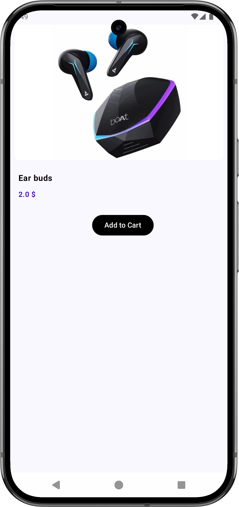

# Jetpack Compose Ecommerce App

## Overview

This is a sample e-commerce application built using Jetpack Compose for the UI. It demonstrates modern Android development practices, including integration with Firebase Firestore and Room Database.

## 📱 App Screenshots

<div align="center">
  
  
  
  
</div>

## Features

- **Browse Products**: Users can browse through a variety of products.
- **Product Details**: View detailed information about each product, including images, descriptions, and pricing.
- **Add to Cart**: Users can add products to their shopping cart.
- **Shopping Cart**: View and manage items in the cart.
- **Checkout**: Implement a basic checkout process.

## Data Management

- **Firebase Firestore**: Product data is stored and fetched from Firestore, ensuring seamless synchronization across devices.
- **Room Database**: Cart data is stored locally using Room Database for offline access and faster operations.

## Technologies Used

- **Jetpack Compose**: A modern toolkit for building native Android UI.
- **Kotlin**: The primary programming language for Android development.
- **Firebase Firestore**: For cloud-based data storage and real-time updates.
- **Room Database**: For local data persistence.
- **Coroutines**: For asynchronous programming.

## Architecture

The app follows the MVVM (Model-View-ViewModel) architecture:

- **Model**: Handles data fetching from Firestore and local storage via Room.
- **View**: UI built with Jetpack Compose.
- **ViewModel**: Provides data to the UI and handles user interactions.

## Setup Instructions

1. **Clone the Repository**:
    ```
    git clone https://github.com/developer-nkchauhan/Jetpack_Compose-EcommerceApp.git
    ```

2. **Open in Android Studio**:
    - Open Android Studio.
    - Select "Open an Existing Project" and choose the cloned directory.

3. **Configure Firebase**:
    - Connect your app to Firebase via `Tools > Firebase > Cloud Firestore`.
    - Add the required dependencies for Firebase Firestore in your `build.gradle` file.

4. **Build and Run**:
    - Ensure you have the latest Android SDK and build tools.
    - Build the project using `Build > Make Project`.
    - Run the app on an emulator or physical device.

## Contributing

Contributions are welcome! Please follow these steps:

1. Fork the repository.
2. Create a new branch for your feature or bug fix.
3. Commit your changes.
4. Push to your forked repository.
5. Submit a pull request.

## License

